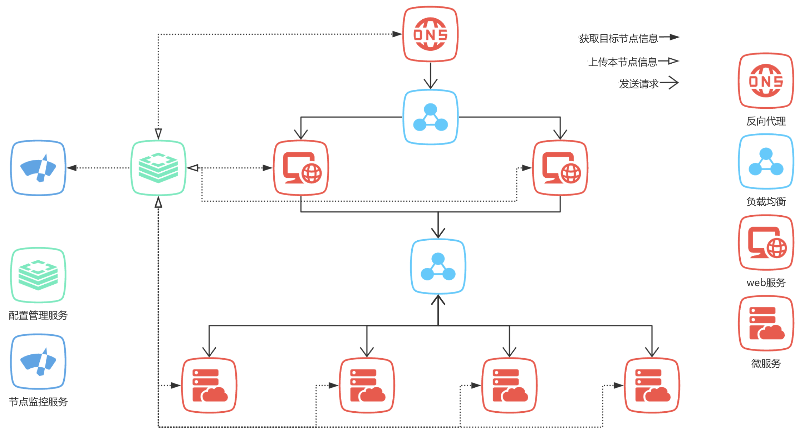
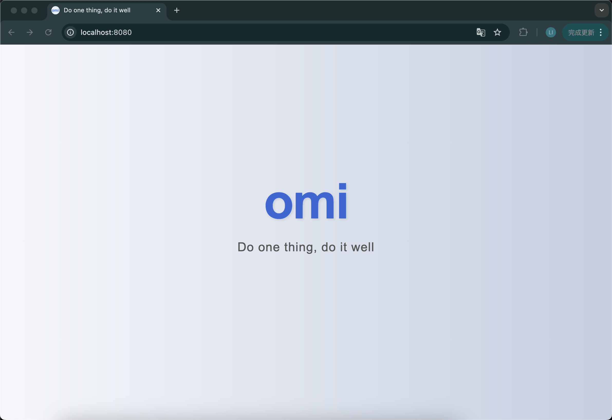
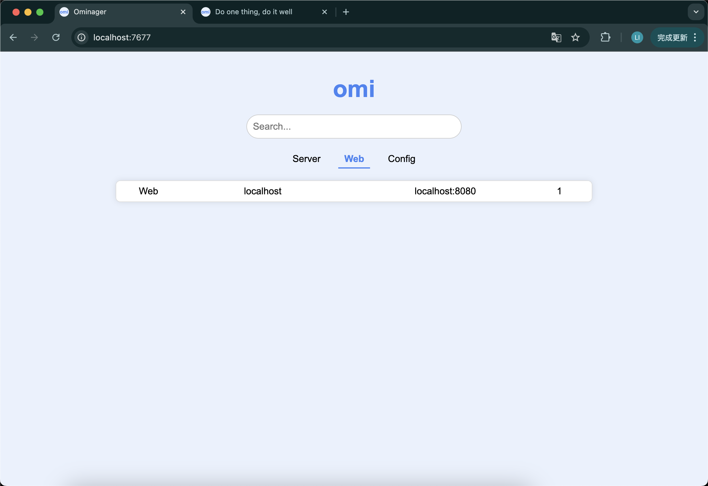
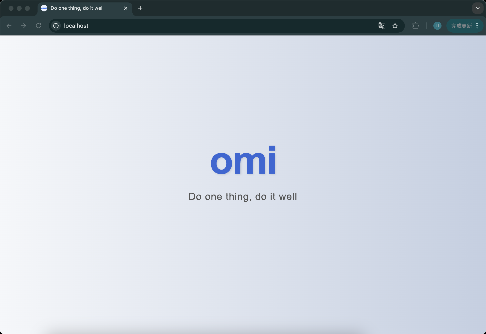

# Omi 基于服务注册与发现的前后端微服务框架
作者：stormi-li 

Email：2785782829@qq.com
## 简介
目前主流的反向代理工具都是通过配置文件来配置反向代理的节点信息，这种方式虽然简单直观，但静态配置方式存在以下缺点：

* 节点变更需要手动修改配置并重启服务。
* 缺乏灵活性，难以满足自动化和弹性伸缩需求。
* 随着系统规模扩大，配置文件难以管理和维护。
* 不支持实时变更，调整代理规则或节点信息时需要重启服务。

为了解决上述问题，本框架基于服务注册与发现的思想，设计了一个动态管理节点信息的解决方案，
该方案将配置信息存放在配置管理服务器中，反向代理服务通过连接配置管理服务器来更新配置信息，
这种分布式的配置管理方案能够显著降低系统耦合度，增加系统灵活性、健壮性和可扩展性。
## 贡献
* 支持反向代理(http, https, websocket)，支持将反向代理接入服务注册与发现系统。
* 支持服务注册与发现，支持心跳检测，支持分布式配置管理。
* 支持构建 Web 服务，支持静态资源打包。
* 支持负载均衡，支持静态资源缓存。
* 所有方案基于 Redis 实现，没有引入新的技术栈，没有引入新的中间件，不会增加系统复杂度。
## 架构图

在该架构中，所有的节点均需要实时向配置管理服务器上传本节点状态，因此配置管理服务器拥有所有节点信息，任何节点都可以向配置管理服务器询问目标服务地址，因此任何节点在本地都无需存储其他节点的配置信息，整个系统的耦合度大大降低，大大增加了系统的健壮性和可扩展性。
## 快速开始
### 安装
```shell 
go get github.com/stormi-li/omi
```
### 启动web服务
```go
package main

import (
	"github.com/go-redis/redis/v8"
	"github.com/stormi-li/omi"
)

var redisAddr = "localhost:6379"
var password = ""

func main() {
	web := omi.NewWebClient(&redis.Options{Addr: redisAddr, Password: password})
	web.GenerateTemplate()
	webServer := web.NewWebServer("localhost", 1)
	webServer.Listen("localhost:8080")
}
```
执行 go run main.go，在unix系统中如果遇到访问权限问题使用sudo go run main.go。
在浏览器搜索[http://localhost:8080](http://localhost:8080)，出现如下界面表示Web服务启动成功。

### 启动监控服务
```go
package main

import (
	"github.com/go-redis/redis/v8"
	"github.com/stormi-li/omi"
)

var redisAddr = "localhost:6379"
var password = ""

func main() {
	monitor := omi.NewMonitor(&redis.Options{Addr: redisAddr, Password: password})
	monitor.Listen("localhost:7677")
}
```
在浏览器搜索[http://localhost:7677](http://localhost:7677)，出现如下界面表示上面启动的web服务已经完成了注册
 


### 启动反向代理服务
```go
package main

import (
	"github.com/go-redis/redis/v8"
	"github.com/stormi-li/omi"
)

var redisAddr = "localhost:6379"
var password = ""

func main() {
	web := omi.NewWebClient(&redis.Options{Addr: redisAddr, Password: password})
	proxyServer := web.NewProxyServer("http反向代理")
	proxyServer.StartHttpProxy("localhost:80")
}
```
在浏览器搜索[http://localhost](http://localhost)，出现如下界面说明反向代理启动成功

